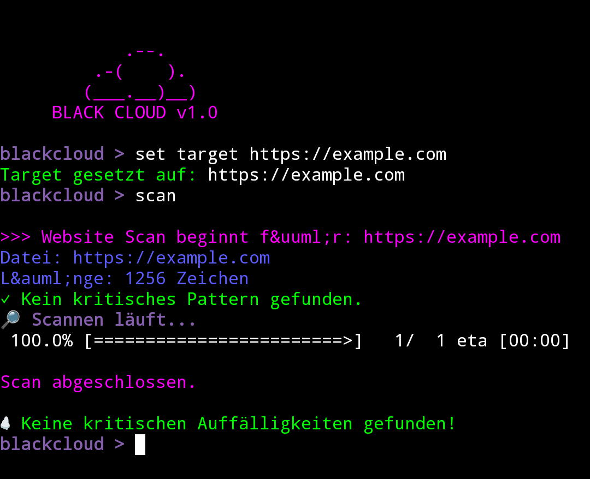

# BlackCloud
A web vulnerability scanner.

## Supported Languages

- **German (de)** — only for the `scan`, `info` & `set target` command  
- **English (en)** — partial support

## Planned Language Support

- **English (en)** — full support coming soon

## Installation
``` bash
git clone https://github.com/LunarXYZ-l/BlackCloud.git
cd blackcloud
pip install -r requirements.txt
python3 BlackCloud
```

## Usage

- After starting, type `help` for a list of commands.
- To set your target website:
`set target https://example.com`
- To start scanning:
scan

## Preview



